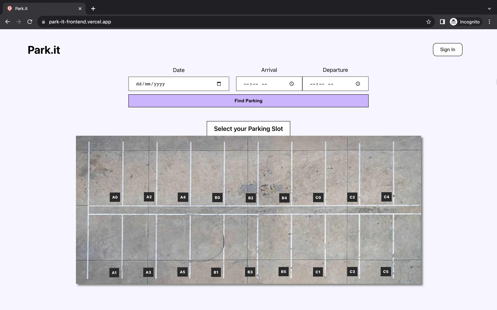
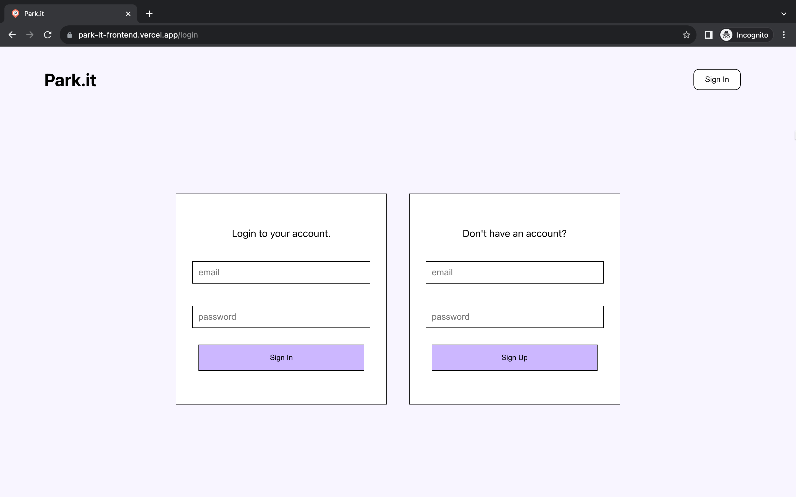
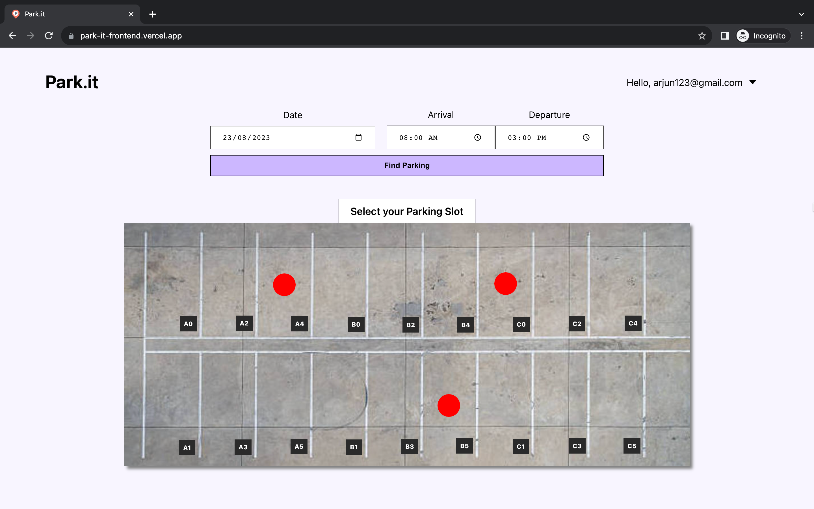
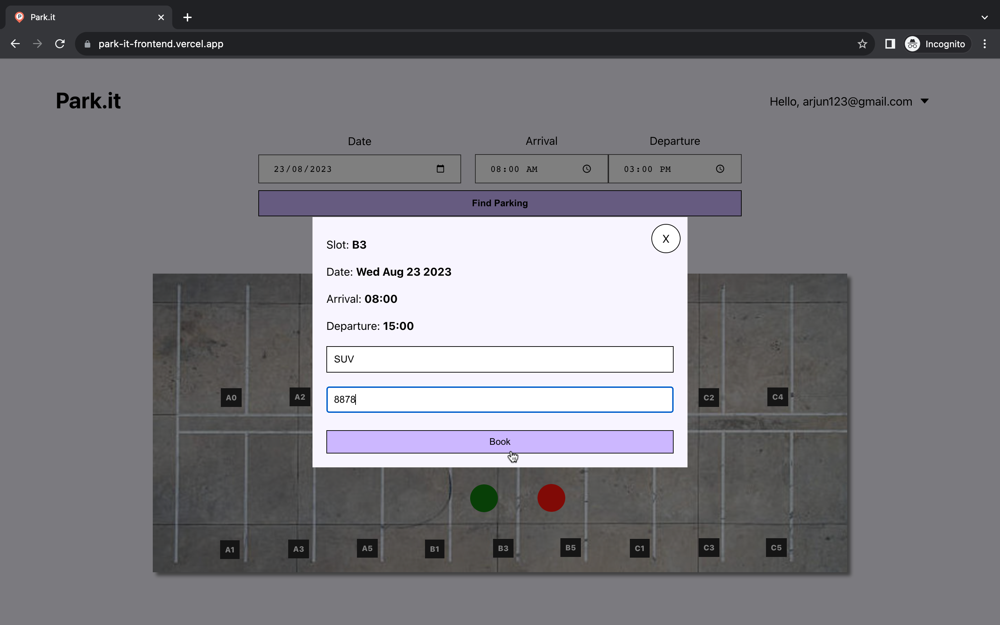
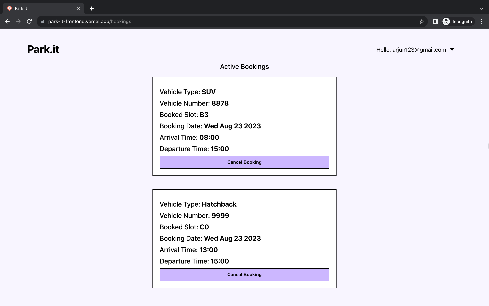
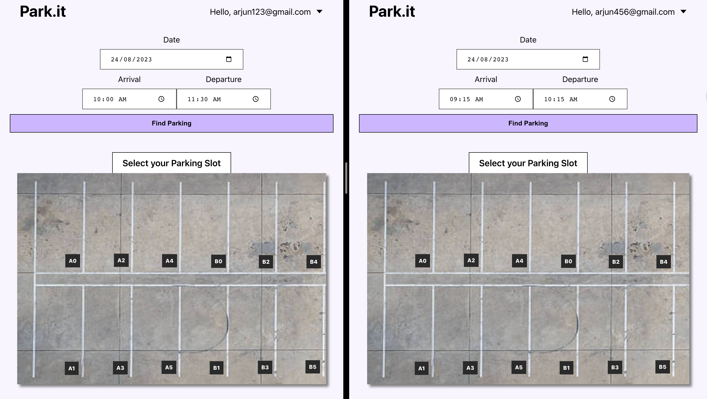
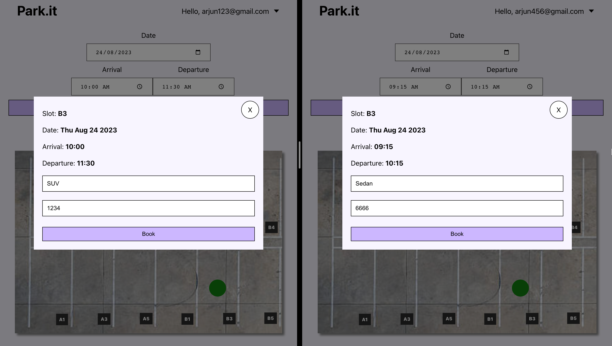
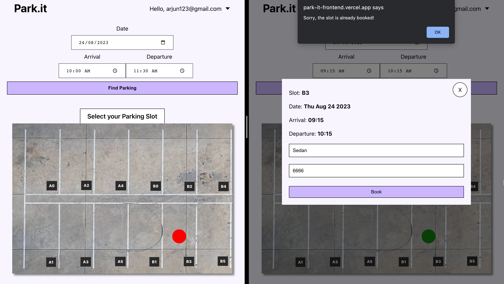

# Park-it

A fully responsive web app where users can **sign up**, **search**, and **reserve parking slots** based on their preferred date and duration. The app also provides a feature to **view the status of booked slots** and **allows cancellations**. Booked slots are **automatically removed** from the database once the specified date and duration have passed.

**Concurrent bookings** of the same free slot by multiple users for the same preferred date and overlapping time duration is also handled and only one user gets the slot.

## Tech Stack

This is a Full Stack Web Application.

**Client:** React.js, CSS3

**Server:** Node.js, Express.js

**Database:** MongoDB Atlas

**Miscellaneous:** Redux, Firebase Authentication

## Deployment

Frontend and Backend both are deployed at [Vercel](https://vercel.com/ "Vercel").

## Live

🎉😋 Check it out 👉 [Park-it](https://park-it-frontend.vercel.app/ "Park-it")

## Screenshots

- Home Page
  

- Sign In / Sign Up:
  

- Searching free parking slots for the preferred date and time duration. Red markers show that the slot is booked.
  

- Booking a slot:
  

- User's Future Bookings:
  

- Handling Concurrent Bookings:

  - Both select the same date (i.e, say 24/08/23) and overlapping time duration(9:15AM to 10:15AM for the right user and 10:00AM to 11:30AM for the left user) and search parkings.
    

  - Both see that parking slot B3 is free and proceed to book it.
    

  - Left user is able to secure the slot but Right user sees error.
    
